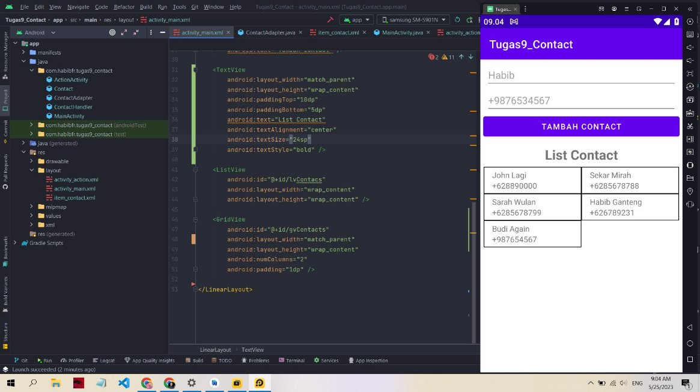
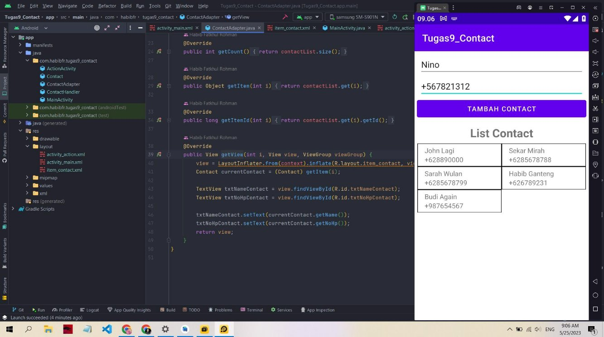
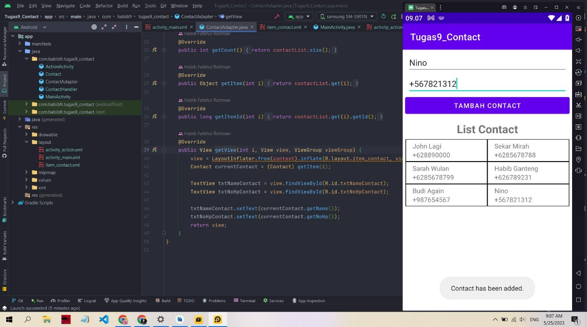
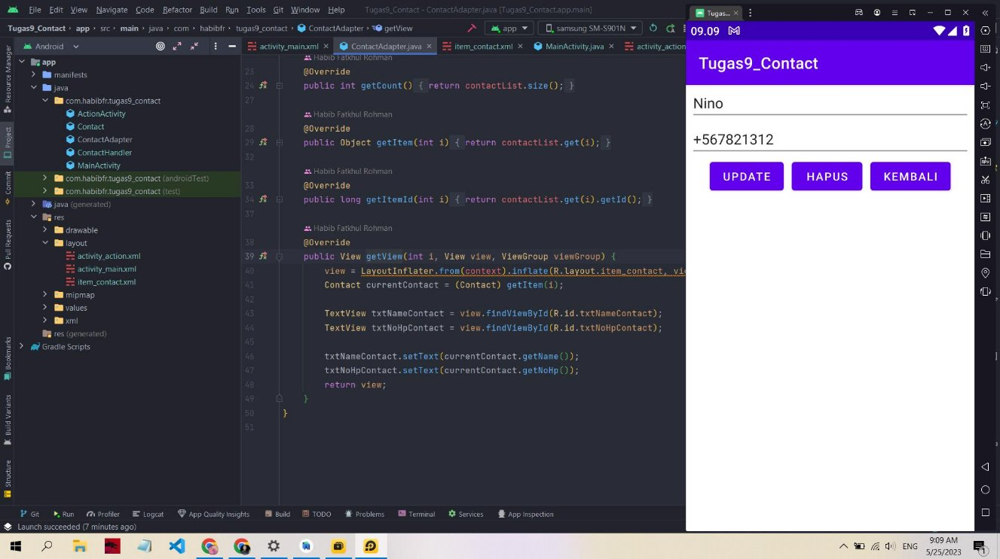
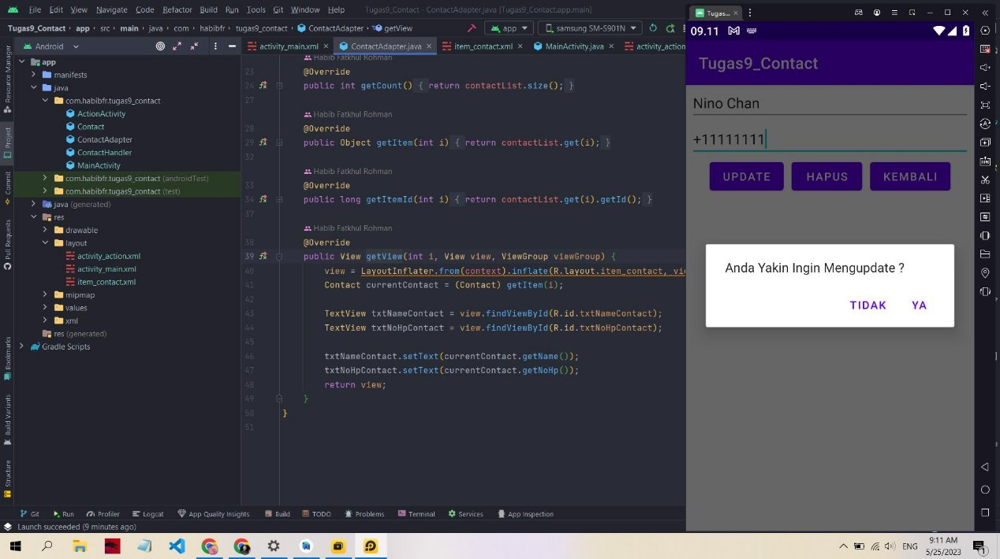
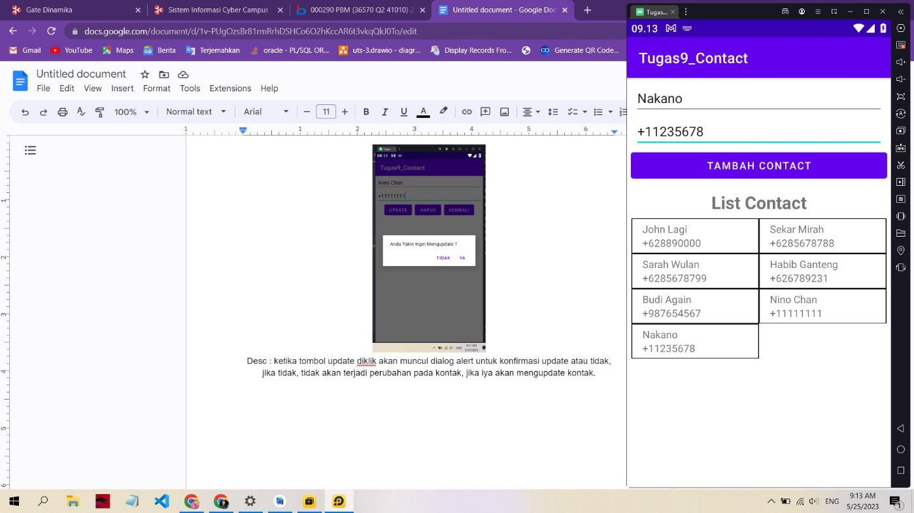
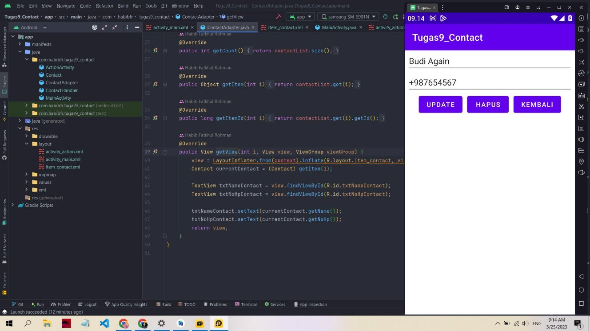
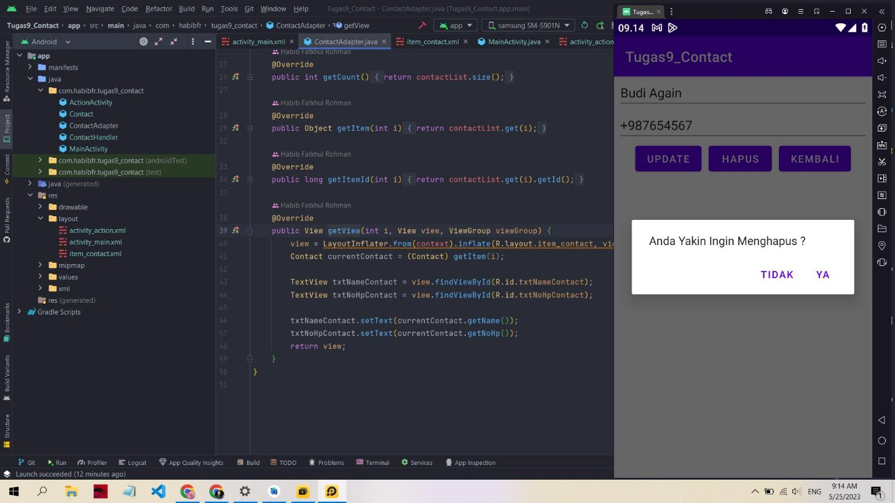
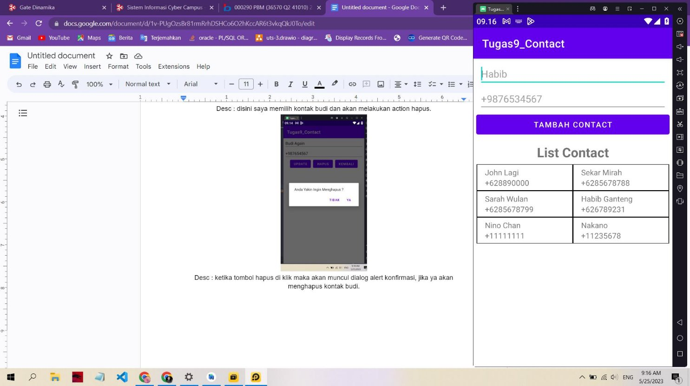

**NIM : 21410100050**

**Nama : Habib Fatkhul Rohman**

**Matkul : PBM**

Desc : Tampilan awal saat aplikasi dibuka, form untuk tambah kontak dan, gridview daftar kontak.

Desc : mencoba menambahkan kontak nino.

Desc : saat kontak nino ditambahkan, akan mengupdate daftar list kontak

Desc : saat akan menambahkan kontak tetapi dengan field kosong, makan akan muncul toast pesan error.

Desc : saat salah satu kontak di klik, akan pindah ke activity lainya, disini dapat melakukan edit dan hapus kontak.

Desc : ketika tombol update diklik akan muncul dialog alert untuk konfirmasi update atau tidak, jika tidak, tidak akan terjadi perubahan pada kontak, jika iya akan mengupdate kontak.

Desc : hasil ketika melakukan update pada kontak nino

Desc : disini saya memilih kontak budi dan akan melakukan action hapus.

Desc : ketika tombol hapus di klik maka akan muncul dialog alert konfirmasi, jika ya akan menghapus kontak budi.

Desc : kontak budi sudah terhapus dan tidak ada dalam daftar.
