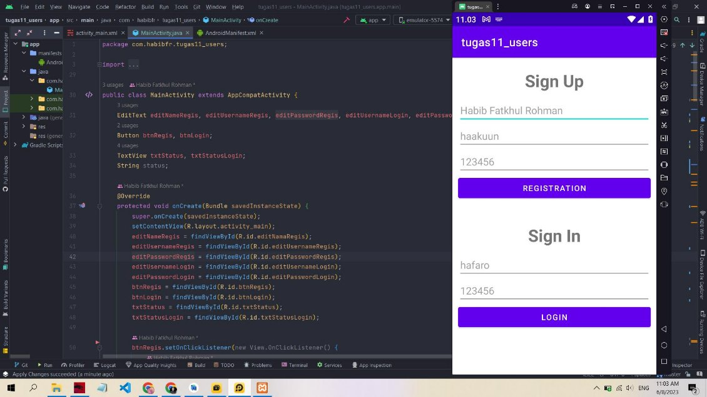
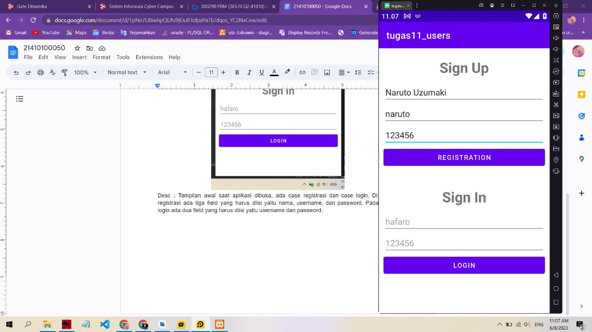
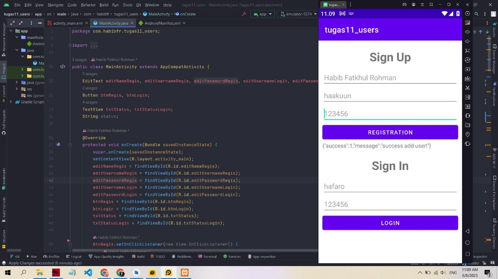
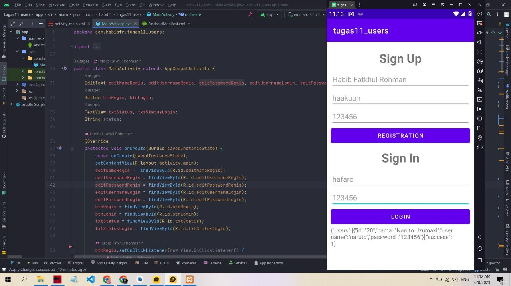
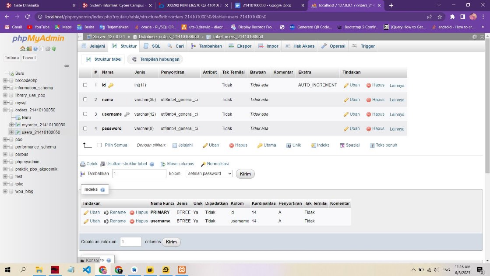

**NIM : 21410100050**

**Nama : Habib Fatkhul Rohman**

Desc : Tampilan awal saat aplikasi dibuka, ada dua case yaitu case registrasi dan case login. Di Bagian registrasi ada tiga field yang harus diisi yaitu nama, username, dan password. Pada bagian login ada dua field yang harus diisi yaitu username dan password.

Desc : Disini kita akan registrasi dengan nama uzumaki naruto, username naruto dan password naruto, kemudian kita klik tombol registrasi dan hasilnya akan seperti gambar dibawah.

Desc : Hasil dari registrasi user, berupa pesan success add user, kemudian kita akan melakukan login dari user yang sudah kita buat.

Desc : kita mengisi field login dengan data yang sudah kita daftarkan sebelumnya, yaitu username naruto dan password 123456, kemudian kita klik tombol login.

Desc : hasil dari klik tombol login adalah seperti diatas, berupa pesan detail user.

Desc : Struktur tabel database untuk users yaitu id(primary key), nama, username(unique), dan password.

Code : Register.php <?php

include "../database/db\_config.php";

*// if (isset($\_POST["simpan"])) {* $response = array();

if (isset($\_POST["nama"]) && isset($\_POST["username"]) && isset($\_POST["password"])) {

$nama = $\_POST["nama"];

$username = $\_POST["username"];

$password = $\_POST["password"];

if (empty(trim($nama)) || empty(trim($username)) || empty(trim($password))) {

echo "please isi field";

exit();

}

$sql = "INSERT INTO `users\_21410100050` (`id`, `nama`, `username`, `password`) VALUES (NULL, '$nama', '$username', '$password');";

$result = mysqli\_query($conn, $sql);

if ($result > 0) {

$response["success"] = 1;

$response["message"] = "success add user!"; } else {

$response["success"] = 0; $response["message"] = "gagal add user!";

}

echo json\_encode($response); exit();

}

*// }*

?>

<!DOCTYPE html> <html lang="en">

<head>

<meta charset="UTF-8">

<meta http-equiv="X-UA-Compatible" content="IE=edge">

<meta name="viewport" content="width=device-width, initial-scale=1.0"> <title>Document</title>

</head>

<body>

<form action="" method="post">

<label for="nama">Nama : </label>

<input type="text" name="nama" id="nama"> 

<label for="username">Username : </label>

<input type="text" name="username" id="username">  <label for="password">Password : </label>

<input type="text" name="password" id="password">  

<input type="submit" value="simpan" name="simpan"> </form>

</body>

</html>

Code : Login.php

<?php

include "../database/db\_config.php";

$response = array();

*// if (isset($\_POST['login'])) {*

if (isset($\_POST['username']) && isset($\_POST['username'])) {

$username = $\_POST['username'];

$password = $\_POST['password'];

$sql = "select \* from users\_21410100050 where username= '$username' and password='$password'";

$result = mysqli\_query($conn, $sql);

if (mysqli\_num\_rows($result) > 0) {

$response['users'] = array();

while ($row = mysqli\_fetch\_array($result)) {

$item = array();

$item['id'] = $row['id']; $item['nama'] = $row['nama']; $item['username'] = $row['username']; $item['password'] = $row['password'];

array\_push($response["users"], $item);

}

$response["success"] = 1;

} else {

$response["success"] = 0;

$response["message"] = "Failed to login, invalid username or password";

}

echo json\_encode($response); exit();

}

*// } *?>

<!DOCTYPE html> <html lang="en">

<head>

<meta charset="UTF-8">

<meta http-equiv="X-UA-Compatible" content="IE=edge">

<meta name="viewport" content="width=device-width, initial-scale=1.0"> <title>Document</title>

</head>

<body>

<form action="" method="post">

<label for="username">Username : </label> 

<input type="text" name="username" id="username">  <label for="password">Password : </label> 

<input type="text" name="password" id="password"> 

<input type="submit" value="login" name="login"> </form>

</body>

</html>
